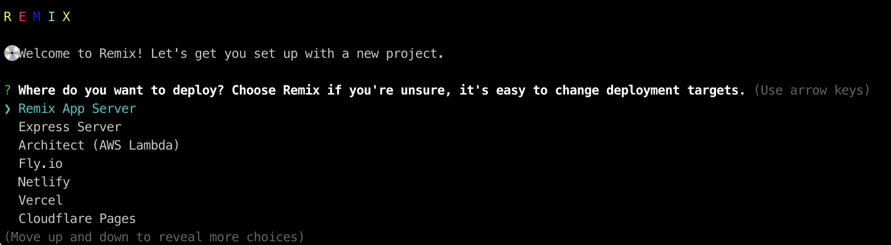

## Remix Quickstart 들어가기 전에
- 리믹스에서 제공하는 Quickstart의 주제는 Blog 만들기이다.
- 풀스택 프레임워크이지만 본 예제에서 DB를 다루지는 않는다. 대신 파일 시스템 읽고 쓰는 것을 사용한다.
- [원문](https://remix.run/docs/en/v1/tutorials/blog)에서는 JS를 먼저 사용하고 나중에 type을 추가해 TS로 구성하는 방식이지만 본 포스팅에서는 TS코드를 바로 사용했다. 


### 1. 시작 전 세팅
- Node.js 14 이상
- npm 7 버전 이상

### 2. shell 로 리믹스 프로젝트 만들기
이미 작업 폴더를 만들었다면 1-option1 을 사용하고 그렇지 않다면 1-option2를 사용한다.

```shell
// 1-option1 이 방법을 사용하면 package.json의 프로젝트 name은 remix-app-template으로 생성된다
$ mkdir remix-text
$ npx create-remix@latest .

// 1-option2 
$ npx create-remix@latest remix-test

// 2. 실행되는 prompt 에서 배포 플랫폼, 사용 언어, npm 설치 여부를 묻는다. 
본 포스팅에서는 Remix App Server, typescript, npm install을 선택했다.

// 3. 개발모드로 실행한다
$ npm run dev
```
<br />
프롬프트에서 선택할 수 있는 배포 플랫폼에는 Remix App Server, Express Server, AWS Lambda, Fly.io, Netlify, Vercel, Cloudflare Pages, Cloudflare Workers 가 있다. <br/>
본 포스팅에서는 Remix App Server를 사용한다. <br/>
만약 배포할 계획이 있다면 배포 플랫폼에 맞게끔 타겟을 변경해주면 된다. 변경하는 방법은 생성된 프로젝트의 README 에서 확인 가능하다. 아래는 프롬프트에서 배포 타겟을 정하는 단계의 캡쳐본이다.
<br />



앱 실행 시 http://localhost:3000 에서 제대로 실행되지 않는다면 `postinstall` 이 실행되었는지 확인해본다. 만약 실행되지 않았다면 `npm run postintall`로 직접 실행해준다. npm config 파일에 `ignore-scripts=true`가 추가되어있거나 pnpm 또는 다른 패키지 매니저를 사용하고 있다면 자동으로 postinstall 이 실행되지 않을 수 있다.

### 3. routes 폴더를 사용해 /posts 라우트 만들기

이미 생성되어 있는 `app/routes/index.tsx` 의 기존 내용을 지우고 아래와 같이 구성해 준다.

```ts
// app/routes/index.tsx

import { Link } from 'remix';

export default function Index() {
    return <Link to='/posts'>Posts</Link>;
}
```

+ 참고: `app/root.tsx`에 `<Outlet/>`, `<Scripts />`가 있기 때문에 `<Link />`는 어느 곳에서나 사용 가능하다. 

다음에 `app/routes/posts/index.tsx`를 생성해준다.

```ts
// app/routes/posts/index.tsx

export default function Posts() {
  return (
    <div>
      <h1>Posts</h1>
    </div>
  );
}
```
이제 http://localhost:3000/posts 에서 Posts를 확인할 수 있을 것이다.
폴더명 하위에 index라는 이름으로 컴포넌트를 만듦으로 폴더명과 같은 route를 생성할 수 있고, index가 아닌 다른 파일명을 추가할 경우, `/폴더명/index가 아닌 파일명` 으로 라우트가 생성된다.


### 4. loader를 사용해 데이터 불러오기
리믹스 프론트 컴포넌트에서는 fetch를 사용할 필요가 없다. loader를 통한 데이터 불러오는 로직을 리믹스 자체적으로 제공해주고 있다. 

위에서 만든 `routes/posts/index.tsx`에 loader를 붙여보자.

posts를 가져오는 모듈 파일을 아래와 같이 만든다.

```ts
// app/post.ts

export type Post = {
  slug: string;
  title: string;
};

export function getPosts() {
  const posts: Post[] = [
    {
      slug: "my-first-post",
      title: "My First Post"
    },
    {
      slug: "90s-mixtape",
      title: "A Mixtape I Made Just For You"
    }
  ];
  return posts;
}

```

<br/>

해당 파일을 `/routes/posts/index.tsx` 에 import 시켜 loader에 적용시켜준다.
그리고 post의 slug로 이동하게 되는 Link도 추가해준다.

```ts 
// app/route/posts/index.tsx

import { Link, useLoaderData } from 'remix'; // 추가
import { getPosts, Post } from "~/post";

export const loader = async () => {
  return getPosts(); // 추가
};

export default function Posts() {
  const posts = useLoaderData<Post[]>(); // 추가
  console.log(posts); // 테스트용 콘솔 로그 추가

  return (
    <div>
      <h1>Posts</h1>
      <ul>
        {posts.map(post => ( // 추가
          <li key={post.slug}> // 추가
            <Link to={post.slug}>{post.title}</Link> // 추가
          </li> // 추가
        ))} // 추가
      </ul>
    </div>
  );
}
```
<br />

loader는 컴포넌트를 위한 백엔드 API이고 `useLoaderData`로 데이터를 불러와 사용할 수 있다. 서버와 브라우저 콘솔 모두 열려있다면 두 군데 모두 log가 찍힌 것을 볼 수 있을 것이다. 이유는 리믹스가 서버에서 HTML 파일을 보내기 위해 render 하고 이후 클라이언트에서 해당 HTML 파일로 hydrate 하기 때문이다.
[참고: React > hydrate()](https://ko.reactjs.org/docs/react-dom.html#hydrate)

### 5. 파일 시스템으로 파일 불러오기
일반적으로 저장하고 불러오는 작업은 DB를 활용하겠지만 지금은 튜토리얼이니 파일 시스템을 사용한다.

최상위 디렉토리에 데이터베이스가 될 posts 폴더를 생성한다.
그 안에 `my-first-post.md`, `90s-mixtape.md`를 생성한다.

```md
// posts/my-first-post.md

---
title: My First Post
---

# This is my first post

Isn't it great?


// post/90s-mixtape.md

---
title: 90s Mixtape
---

# 90s Mixtape

- I wish (Skee-Lo)
- This Is How We Do It (Montell Jordan)
```
<br/>
불러올 파일들을 만들었으니 getPosts에서 이 파일들을 읽어올 수 있도록 수정한다.

우선 파일 시스템을 읽기 위해 아래 두가지 라이브러리를 설치한다.

```sh
// 파일을 파싱하는 역할
$ npm add front-matter

// 파일 타입 체크하는 역할
$ npm add tiny-invariant
```
<br/>
그 다음 getPosts를 아래와 같이 업데이트한다.

```ts
// app/post.ts

import path from "path";
import fs from "fs/promises";
import parseFrontMatter from "front-matter";
import invariant from "tiny-invariant";

export type Post = {
  slug: string;
  title: string;
};

export type PostMarkdownAttributes = {
  title: string;
};

const postsPath = path.join(__dirname, "..", "posts");

function isValidPostAttributes(
  attributes: any
): attributes is PostMarkdownAttributes {
  return attributes?.title;
}

export async function getPosts() {
  const dir = await fs.readdir(postsPath);
  return Promise.all(
    dir.map(async filename => {
      const file = await fs.readFile(
        path.join(postsPath, filename)
      );
      const { attributes } = parseFrontMatter(
        file.toString()
      );
      invariant(
        isValidPostAttributes(attributes),
        `${filename} has bad meta data!`
      );
      return {
        slug: filename.replace(/\.md$/, ""),
        title: attributes.title
      };
    })
  );
}
```
### 6. $를 사용한 Dynamic route 추가하기

위에서 slug로 연결되는 Link를 추가했으니, slug 라우트에 해당하는 화면을 추가해야 한다.

/routes/posts 폴더 하위에 $slug 파일을 생성한다.
파일명에 `$`를 붙이면 loader의 params 객채에서 `$`뒷 값을 key로 받아올 수 있다.

```ts
// app/routes/posts/$slug.tsx

import { useLoaderData } from "remix";
import type { LoaderFunction } from "remix"; // 추가

export const loader: LoaderFunction = async ({ params }) => { //추가
  return params.slug; // 추가
};

export default function PostSlug() {
  const slug = useLoaderData(); // 추가
  return (
    <div>
      <h1>Some Post: {slug}</h1> // 추가
    </div>
  );
}
```

### 7. params로 데이터 가져오기
`post.ts`에 getPost라는 새로운 함수를 추가한다. slug를 인자로 받고 그에 해당하는 title, slug를 리턴한다.

```ts
// app/post.ts

export async function getPost(slug: string) {
  const filepath = path.join(postsPath, slug + ".md");
  const file = await fs.readFile(filepath);
  const { attributes } = parseFrontMatter(file.toString());
  invariant(
    isValidPostAttributes(attributes),
    `Post ${filepath} is missing attributes`
  );
  return { slug, title: attributes.title };
}

```
<br/>

위의 getPost 함수를 `$slug.tsx` loader에 적용시킨다.

```ts
// app/routes/posts/$slug.tsx

import { useLoaderData } from "remix";
import type { LoaderFunction } from "remix";
import invariant from "tiny-invariant"; // 추가 (타입  체크용)

import { getPost } from "~/post"; // 추가 

export const loader: LoaderFunction = async ({
  params
}) => {
  invariant(params.slug, "expected params.slug"); // 추가 (타입  체크용)
  return getPost(params.slug); // 추가 
};

export default function PostSlug() {
  const post = useLoaderData(); // 추가 
  return (
    <div>
      <h1>{post.title}</h1> // 추가
    </div>
  );
}

```
<br />

실행해서 확인해보면 각 마크다운 파일별로 링크가 있고 하나를 클릭했을 때, 해당하는 마크다운 파일 이름으로 라우트가 이동되고 파일의 title을 그리는 것을 확인할 수 있다.

마지막으로 `marked`라는 라이브러리를 사용해 마크다운 파일 내용을 html 변환해 화면에 그리는 단계가 있지만 여기서는 넘어가도록 하겠다. 

### 8. 블로그 어드민 만들기

글을 포스팅할 때, 단순 오타 수정으로 인해 매번 배포하는 것은 불필요하다. 
 수정된 글을 데이터베이스에 바로 등록한다면 매번 배포를 해야할 일은 없을 것이다. 그래서 포스팅 글을 관리하는 어드민을 만들어보려고 한다.

아래처럼 admin 라우트를 만든다.
```ts
//app/routes/admin.tsx

import { Link, useLoaderData } from "remix";

import { getPosts } from "~/post";
import type { Post } from "~/post";

export const loader = async () => {
  return getPosts();
};

export default function Admin() {
  const posts = useLoaderData<Post[]>();
  return (
    <div className="admin">
      <nav>
        <h1>Admin</h1>
        <ul>
          {posts.map(post => (
            <li key={post.slug}>
              <Link to={`/posts/${post.slug}`}>
                {post.title}
              </Link>
            </li>
          ))}
        </ul>
      </nav>
      <main>...</main>
    </div>
  );
}

```
<br />

시작하기에 앞서 스타일링을 먼저 해준다. (아래에서 진행하는 Nested Routes를 좀 더 잘 보여주기 위함이다.)

``` css
/* app/styles/admin.css */

.admin {
  display: flex;
}

.admin > nav {
  padding-right: 2rem;
}

.admin > main {
  flex: 1;
  border-left: solid 1px #ccc;
  padding-left: 2rem;
}

em {
  color: red;
}

```
<br />
위의 스타일 시트를 admin 라우트에 연결시켜준다.

``` ts
// app/routes/admin.tsx

import { Link, useLoaderData } from "remix";

import { getPosts } from "~/post";
import type { Post } from "~/post";
import adminStyles from "~/styles/admin.css";

export const links = () => {
  return [{ rel: "stylesheet", href: adminStyles }];
};

...
```
<br/>

라우트에서 사용되는 links는 `<link>` 태그를 반환하고 모든 링크들이 모여 root.tsx에 있는 `<Links />`에 렌더링된다. 

### 9. Outlet을 사용한 Nested Routes 만들기

이제 nested routes를 만들어보자.
admin 폴더를 만들고 그 안에 `index.tsx`를 만든다. 클릭시 `/new`로 이동되는 링크도 추가해준다.
```ts
// app/routes/admin/index.tsx

import { Link } from "remix";

export default function AdminIndex() {
  return (
    <p>
      <Link to="new">Create a New Post</Link>
    </p>
  );
}

```
<br />

그리고 `/routes/admin.tsx`에 리믹스에서 제공하는 `<Outlet />` 컴포넌트를 추가한다.

```ts
// app/routes/admin.tsx

import { Outlet, Link, useLoaderData } from "remix"; // 추가

//...
export default function Admin() {
  const posts = useLoaderData<Post[]>();
  return (
    <div className="admin">
      <nav>
      ...
      </nav>
      <main>
        <Outlet /> // 추가
      </main>
    </div>
  );
}
```
<br/>

이제 `/new`에 해당하는 라우트도 만들어보자.

```ts
// app/routes/admin/new.tsx

export default function NewPost() {
  return <h2>New Post</h2>;
}
```
<br/>

실행해서 확인해보자. routes 폴더 하위에 `admin.tsx` 를 만들고 해당 파일에서 `<Outlet />`을 사용하면 그 자리에 ___파일명과 동일한___ 디렉토리 내부 값을 가져온다. `index.tsx`가 기본 값이 되고 `new.tsx` 의 경우 `/admin/new`와 같이 라우트가 생성된다.

### 10. action을 사용해 포스팅하고 useActionData를 사용해 에러 핸들링하기
/new 라우트에 새로운 글을 포스팅할 수 있는 form을 만들어보자.

```ts
// app/routes/admin/new.tsx

import { Form } from "remix";

export default function NewPost() {
  return (
    <Form method="post">
      <p>
        <label>
          Post Title: <input type="text" name="title" />
        </label>
      </p>
      <p>
        <label>
          Post Slug: <input type="text" name="slug" />
        </label>
      </p>
      <p>
        <label htmlFor="markdown">Markdown:</label>
        <br />
        <textarea id="markdown" rows={20} name="markdown" />
      </p>
      <p>
        <button type="submit">Create Post</button>
      </p>
    </Form>
  );
}

```
<br />
포스팅할 수 있는 createPost 함수를 post.ts 모듈에 추가한다.

```ts
// app/post.ts
...
type NewPost = {
  title: string;
  slug: string;
  markdown: string;
};

export async function createPost(post: NewPost) {
  const md = `---\ntitle: ${post.title}\n---\n\n${post.markdown}`;
  await fs.writeFile(
    path.join(postsPath, post.slug + ".md"),
    md
  );
  return getPost(post.slug);
}

```
<br />

createPost를 `new.tsx` 컴포넌트 action에 추가하고, useActionData를 사용해 에러 발생 UI를 만든다.

```ts
// app/routes/admin/new.tsx

import { redirect, Form, useActionData } from "remix";
import type { ActionFunction } from "remix";
import { createPost } from "~/post";
import invariant from "tiny-invariant";

type PostError = {
  title?: boolean;
  slug?: boolean;
  markdown?: boolean;
};

export const action: ActionFunction = async ({ request }) => {
  const formData = await request.formData();

  const title = formData.get("title");
  const slug = formData.get("slug");
  const markdown = formData.get("markdown");

  const errors: PostError = {};
  if (!title) errors.title = true;
  if (!slug) errors.slug = true;
  if (!markdown) errors.markdown = true;

  if (Object.keys(errors).length) {
    return errors;
  }

  invariant(typeof title === "string");
  invariant(typeof slug === "string");
  invariant(typeof markdown === "string");

  await createPost({ title, slug, markdown });

  return redirect("/admin");
};

export default function NewPost() {
  const errors = useActionData();

  return (
    <Form method="post">
      <p>
        <label>
          Post Title:{" "}
          {errors?.title ? (
            <em>Title is required</em>
          ) : null}
          <input type="text" name="title" />
        </label>
      </p>
      <p>
        <label>
          Post Slug:{" "}
          {errors?.slug ? <em>Slug is required</em> : null}
          <input type="text" name="slug" />
        </label>
      </p>
      <p>
        <label htmlFor="markdown">Markdown:</label>{" "}
        {errors?.markdown ? (
          <em>Markdown is required</em>
        ) : null}
        <br />
        <textarea id="markdown" rows={20} name="markdown" />
      </p>
      <p>
        <button type="submit">Create Post</button>
      </p>
    </Form>
  );
}

```
지금 위 상태로 실행하면 자바스크립트 없이도 작동한다. 리믹스가 HTTP, HTML로만 구성되었기 때문이다.

### 11. useTransition을 사용한 Pending UI 만들기

`/admin/new.tsx` action 내부에 setTimeout을 사용해 딜레이를 준다.

```ts
// app/routes/admin/new.tsx

// ...
export const action: ActionFunction = async ({
  request
}) => {
  await new Promise(res => setTimeout(res, 1000)); // 추가

  const formData = await request.formData();

  const title = formData.get("title");
  const slug = formData.get("slug");
  const markdown = formData.get("markdown");
  // ...
};
//...

```
<br />

리믹스에서 제공하는 useTransition을 사용해 form이 포스팅 중인지에 대한 여부를 받아올 수 있다.

```ts
// app/routes/admin/new.tsx

import {
  useTransition, // 추가
  useActionData,
  Form,
  redirect
} from "remix";

// ...

export default function NewPost() {
  const errors = useActionData();
  const transition = useTransition(); // 추가

  return (
    <Form method="post">
      {/* ... */}

      <p>
        <button type="submit">
          {transition.submission // 추가
            ? "Creating..." // 추가
            : "Create Post"} // 추가
        </button>
      </p>
    </Form>
  );
}
```

## 마무리
Remix Docs에서 제공하는 [Quickstart](https://remix.run/docs/en/v1/tutorials/blog)를 따라해보았다.
Remix의 가장 기본이 되는 routing, loader, action을 사용해볼 수 있었고, 전반적으로 리믹스가 어떻게 돌아가는지에 대한 이해를 할 수 있었다. 본 튜토리얼에서 제공하는 기능 외에도 메타 태그, 에러 바운더리 등 편리한 기능이 한 두개가 아니다. 이게 프레임워크지! 라는 생각을 하며... <br/>
다음 포스팅에서는 파일시스템 사용이 아닌 실제 DB를 연동하고 사용하는 방법까지 포스팅해보려고 한다.

```toc
```


