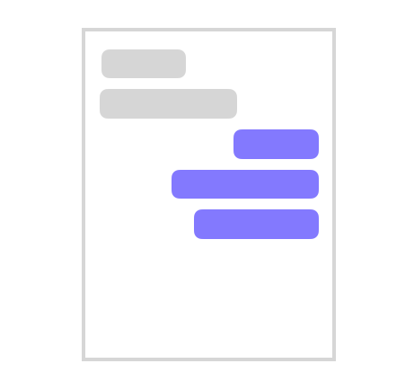
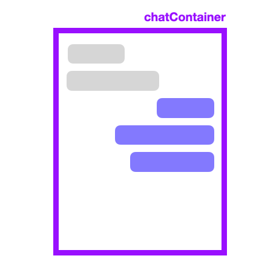
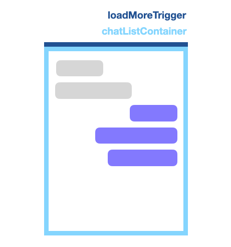
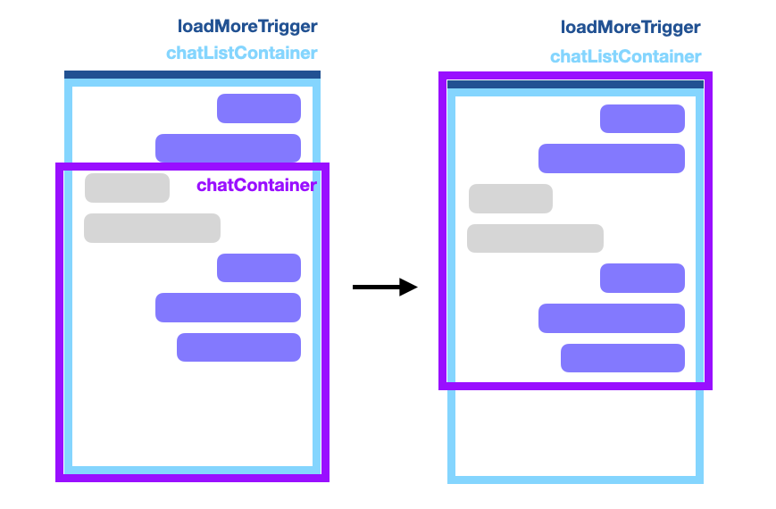

웹에서 채팅 기능을 구현할 기회가 있었다. 소켓을 활용해 실시간 채팅을 구현하는 것 외에도 애를 먹었던 작업f이 있었는데, 바로 스크롤이었다. 

이전 채팅 목록을 확인하기 위해 스크롤을 위로 올리면 유저가 보고 있는 스크롤은 그대로 유지한 채, 위에만 내용을 불러와 붙여야 했다. 

이 작업을 React 프로젝트에서 어떻게 접근했는지 적어보려고 한다. 

## 박스 나누기
아래 이미지처럼 채팅창이 있다고 가정해보자.


채팅창을 감싸는 컨테이너(= chatContainer)를 만들었다. 이 컨테이너는 유저가 채팅을 보는 가시 영역이 된다.


그리고 채팅 리스트를 감싸는 컨테이너(= chatListContainer)를 만들었다. 채팅 리스트 컨테이너 최상단에는 채팅 목록을 추가로 불러올 트리거 역할을 하는 요소(= loadMoreTrigger)를 두었다. 


아래 그림은 유저가 스크롤을 올려 chatListContainer 끝의 loadMoreTrigger가 가시 영역에 포함되는 상황이다.


## Infinite 스크롤 만들기 - IntersectionObserver
Web API에서 제공하는 [IntersectionObserver](https://developer.mozilla.org/ko/docs/Web/API/Intersection_Observer_API)를 사용해 Infinite 스크롤을 구현했다.

위 예제 이미지의 loadMoreTrigger가 IntersectionObserver의 observe 하는 대상이 된다. 유저가 스크롤을 올려 loadMoreTrigger가 가시영역에 들어오게 되면(= isIntersecting) 다음 대화목록을 불러오는 api 요청을 한다.


```js
const loadMoreTrigger = useRef<HTMLDivElement | null>(null);
const isloadMore = useRef<boolean>(false);

useEffect(() => {
  const loadMoreObserver = new IntersectionObserver(
    ([{ isIntersecting }]) => {
      if (isIntersecting) {
        onFetchPreviousPage();
        isloadMore.current = true;
      }
    }
  );

  const trigger = loadMoreTrigger.current!;
  loadMoreObserver.observe(trigger);

  return () => {
    loadMoreObserver.unobserve(trigger);
  };
}, [onFetchPreviousPage]);
```

## 스크롤 위치 유지하기 - ResizeObserver
이전 대화 목록을 불러오니 스크롤이 불러온 데이터를 따라 위로 올라갔다. 채팅 목록이 추가되어도 스크롤이 따라 올라가지 않게끔  하기 위해 사용한 것이
[ResizeObserver](https://developer.mozilla.org/en-US/docs/Web/API/ResizeObserver) 이다.

- 위 예제 그림에서 chatListContainer를 observe 대상으로 했다. 이전 대화 목록을 불러와 chatListContainer에 resize 이벤트가 발생하면 콜백이 실행된다.
- 콜백 인자로 받는 [ResizeObserverEntry](https://developer.mozilla.org/en-US/docs/Web/API/ResizeObserverEntry)를 사용해 변경된 childNodes의 갯수(= nodesRecord)와 높이(= scrollRecord)를 저장해주었다.
- 채팅방에 처음 진입했을 경우는 nodeRecord가 초기값(= 0)인 것을 활용해 구분했다.
- 채팅에 데이터가 추가된 경우는 nodeRrecord에 저장된 값과 현재 변경된 childNodes의 갯수가 다를 때만으로 한정지었다. (채팅 데이터를 불러오는 과정에서 resize 이벤트가 한번만 발생하지 않기 때문이다.)
  - 이때 isLoadMore가 false인 경우는 추가된 데이터가 있지만 trigger로 불러온 데이터가 아니므로 새로운 메시지가 온 것에 대한 구분을 하는데 사용했다.
  - 그 외 경우엔 요소의 변경된 높이(= contentRect.height)에서 앞서 저장해두었던 scrollRecord를 뺀 값만큼 스크롤을 내려 위치를 유지시킬 수 있었다.

```js
const containerRef = useRef<HTMLDivElement | null>(null);
const chatListContainerRef = useRef<HTMLDivElement | null>(null);
const scrollRecord = useRef<number>(0);
const nodesRecord = useRef<number>(0);
/** loadMoreTrigger 상태 관리용 */
const isloadMore = useRef<boolean>(false);

useEffect(() => {
  const container = containerRef.current!;
  const chatListContainer = chatListContainerRef.current!;

  const callback: ResizeObserverCallback = (entries) => {
    entries.forEach((entry) => {
      /** 처음 진입 시 스크롤 맨 아래로 */
      if (!nodesRecord.current) {
        container.scrollTo({
        top: Number.MAX_SAFE_INTEGER,
      });
      isloadMore.current = false;

      /** 채팅 데이터가 추가될 경우 */
      } else if (nodesRecord.current !== entry.target.childNodes.length) {

      /** 추가된 데이터가 있는데 isLoadMore가 false인 경우는 새로운 채팅이므로 맨 아래로 내림 */
        if (!isloadMore.current) {
          container.scrollTo({
            top: Number.MAX_SAFE_INTEGER,
            behavior: 'smooth',
          });

        /** 이 외에는 resized된 높이에서 이전에 저장해놓은 높이 만큼을 내려 스크롤의 위치를 유지시킴 */
        } else {
          isloadMore.current = false;
          container.scrollTo({
            top: entry.contentRect.height - scrollRecord.current,
          });
        }
      }

    /** 추가된 채팅 노드 정보 업데이트 */
    nodesRecord.current = entry.target.childNodes.length;
    scrollRecord.current = entry.contentRect.height;
    });

  };

  const observer = new ResizeObserver(callback);
  observer.observe(chatListContainer, { box: 'border-box' });

  return () => {
    observer.disconnect();
  };
}, []);
```


```toc
```


