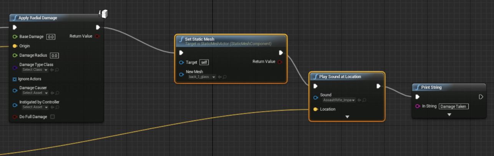

## 개발자로서 첫 퇴사 
스타트업 칼바람이 불고 있었다. 다니고 있던 회사도 이를 피하지 못했고, 전사 회의에서 불안한 재정 상황에 대해 설명했다. 몇개월 후, 20명이 넘던 프로덕팀 모두 회사를 나왔다.

동료분들이 몇 회사와 커피챗을 마련해주었다. 이때, 저연차 프론트엔드 개발자에게 통상적으로 요구되는 지식 레벨보다 한참 모자란 상태라는 것을 알게 됐다. 잘 짜여진 코드베이스 위에서 그때 그때 요구 사항에 따라 적절히 변형하고, QA받고, 배포했던 나날들이 스쳐지나갔다. 큰 고민없이 결과물만 빠르게 만들던 날들에 발등을 찍혀버렸다. 

이후 회사에서 사용했던 스택들이 어떤 특성이 있고, 사용해본 API는 뭐가 있으며, 어떤 문제를 해결하고 구동 원리는 무엇인지에 대해 공부했다. 늦었다고 생각했지만, 공부해가면서 '오히려 좋아'를 외쳤다. 우물 안 개구리처럼 아무것도 모른채로 스스로 만족하며 연차가 쌓였을 것을 생각하면 아찔했기 때문이다. 

## 두번째 회사 입사, 처음 본 것 투성이
### 도메인 로직이 분리된 소스코드를 처음 보다
개념 공부를 하며 면접 준비를 하니 결국 기회를 얻을 수 있었다. 프론트엔드에서 도메인 로직이 UI와 완전히 분리된 코드를 처음 봤다. 도메인 디렉토리 하위에는 모델, 레포지토리, 서비스 등으로 구분되어 있었다. 모두 생소한 개념이었다. 리액트를 사용한 UI 구현부는 도메인과 같은 레벨에서 프레젠테이션이라는 이름으로 분리되어 있었다. 이를 계기로 아키텍쳐에 관심을 갖고 공부하기 시작했다. 당시 운 좋게 회사에서 책 클린 아키텍쳐 스터디를 진행했고, 여기 참여하며 낯선 코드에 대한 이해도를 조금씩 높여나갈 수 있었다.
### 번역 하나 추가되었을 뿐인데
글로벌 진출을 염두에 둔 프로덕트였기 때문에 번역이 필수였다. i18next를 이때 처음 사용해봤다. 영어와 한글의 어순이 다르다보니 설계 시 고려해야하는 부분이 있다는 것을 알았고, QA에서도 번역이 잘 되었는지 검수하는 과정이 추가되었다. 디자인 역시 영어로 변경했을 때 글자가 길어지는 경우가 있기 때문에 ellipsis 같은 처리가 항상 고려되어야 했다. 영어와 한글 2가지만 대응했지만 이후 다른 언어를 추가로 대응한다고 했을 때, 쉽지 않겠다는 생각을 했다. 한/영을 제외한 언어를 대응하는 프로덕트를 한국에서 만나기 쉽지 않을 것이기 때문에 필요성이 커지면 그때 좀 더 고민해봐야겠다.
### 의존성 그래프를 보는 재미
프론트 테크리드님의 제안으로 nx를 사용해 소스코드를 분리하는 작업이 있었다. 이미 도메인이 적절하게 분리되어있었기 때문에 큰 어려움은 없을 것이라 판단했으나, 역시나 얽히고 설킨 곳이 존재했다. 분리하며 고생하시는 리드님과 동료분을 보며 패키지 분리란 쉽지 않은 것이구나라는 것을 느꼈다. 이후 피쳐 개발을 하며 A라는 패키지 분리를 해보았다.  app으로 볼 수 있는 패키지가 2개 있었는데, 이 2개의 app은 서로를 의존하면 안되고 다른 패키지가 app을 바라보고 있어서도 안됐다. 분리한다고 했는데, 자꾸 circular dependency 에러가 떴다. 이때 nx graph라는 명령어를 통해 패키지별 의존성을 눈으로 확인하며 작업했다.
graph에서 의존 방향을 나타내는 화살표를 클릭하면 어느 파일에서 의존하고 있는지까지 확인할 수 있다. 이를 사용해 불필요한 의존이 있는 코드를 찾아내 손쉽게 삭제할 수 있었다. 그러나 분명히 graph 에서 표시된 파일에서 의존성을 삭제해도 graph에 반영되지 않는 이슈가 있었다. 숨은 의존성이 있나 아무리 찾아봐도 별다른게 보이지 않았다. 혹시 몰라 nx 캐시를 지워보니 잘 작동하는 것 아닌가. 캐시에 의존성이 숨어있던 것이었다(?). 즐거운 삽질이었다.

### 원팀 스피릿을 느낄 수 있는 유저 스토리 매핑, 헤븐 미팅
개발, 디자인, CX, 마케팅, 데이터의 모든 팀원이 모여 [유저 스토리 매핑](https://spoqa.github.io/design-toolkit/project/user-story-map)이라는 것을 했다. 이후 진행될 사이클의 큰 그림을 그리기 위한 자리다. 프로덕트의 방향성과 동작에 대해 다같이 높은 얼라인을 맞출 수 있는 활동이다. 이전 회사는 PM 조직에서 기획을 마무리하고 개발 조직에서 된다/안된다 의견을 주는 방식이 대다수였다. 그러나 여기선 모든 팀원의 의견이 프로덕트에 바로 반영될 수 있었다. 합류한지 얼마 안된 신입에게 도메인을 빠르게 이해할 수 있었던 소중한 경험이었다. 

사이클을 시작하기 전에는 헤븐 미팅이라는 것을 했다. 원래는 목적을 달성할 때까지 끝나지 않는 미팅이라는 의미로 헬 미팅이었는데, 어감이 좋지 않아 헤븐으로 바뀌었다고 한다. ㅋㅋ 여기선 이번 사이클에 개발될 피쳐가 대략 정해져 있고 디자인이 공유된다. 팀원 모두 의견을 내며 더 나은 UI/UX를 제안하거나, 구현 가능 여부에 대해 논의한다. 이 미팅에서 개발팀의 의견이 중요해진다. 합류한지 얼마 안된 시점에는 기존 팀원들에게서 반감을 살 수 있다는 생각에 의견 내기가 조심스러웠다. 코드도 익숙하지 않았기 때문에 그 자리에서 디자인을 보고 구현 된다, 안된다의 가늠을 해보기도 쉽지 않았다. '윤지님 의견은 어때요?'와 같은 질문이 들어오면 많이 당황했다. 틀린 대답을 하면 어떡하지와 같은 불안감으로 질문 받기가 무서웠다. 하지만 시간이 지날수록 팀원들과 유대 관계가 형성되고 코드도 더 익숙해지면서 불안감을 많이 내려놓고 의견을 낼 수 있었다. 여전히 떨리긴 했지만, 모든 것을 다 알 순 없고 틀려도 괜찮다는 마인드 컨트롤을 배웠다. 정말 모르겠는건 코드를 좀 봐야할 것 같다고 솔직하게 말하고, 다른 것들은 일단 의견을 내고 나중에라도 '엇 알고보니 이렇네요'라고 빠르게 수정할 수만 있으면 된다고 생각했다. 그러니 미팅 자리가 편해졌고 질문이 들어와도 덜 당황할 수 있었다.

## 새로운 피쳐 개발의 시작
합류하게 된 팀은 B2B SaaS 비즈니스를 전개하고 있었다. 기업의 복잡한 세일즈 퍼널을 간단하게 관리할 수 있게하는 세일즈 자동화 툴을 개발했고, 궁극적으로 고객사의 미팅 전환율을 높여주고자 했다. 전환율을 높여주는 여러 기능 중 핵심은 고객사 도입문의 페이지에 임베딩하는 것이었다. 임베딩된 코드는 도입문의 form의 submit 버튼에 연동되어 고객사의 잠재 고객이 제출하기 버튼을 클릭하면 세일즈맨과 바로 미팅을 잡을 수 있게 해준다. 
합류한 시점에는 리드(=잠재고객) 라우터라는 피쳐를 구현하면 됐다. 리드 라우터는 form 내부 여러 input 값에 따라 규칙을 설정하고 그에 맞는 세일즈맨 또는 세일즈 그룹을 배정할 수 있는 기능이다. 아래 그림은 리드 라우터에서 규칙 설정 부분의 UI 예시이다. 네모 박스를 노드, 흰 선을 엣지라고 표현했고, 노드 안에 input 값 별 배정 규칙이 들어갔다.



### 어서와 설계 미팅은 처음이지?
프로덕트 내에서 리드 라우터의 중요도가 높고 스콥도 컸기 때문에 스프린트는 두개로 나뉘었다. 개발 시작 전, 설계 미팅이 있었다. 고객사가 도입문의 form의 input들을 입력하고 그에 맞게 배정 규칙을 설정하고, 설정된 규칙에 따라 올바른 세일즈맨 그룹이 배정되어야 했다. 이미 복잡도가 높은 기획에서 프론트와 서버에서 각기 다른 라우팅 구현체를 만들어 사용하면 얼라인이 어렵고, 문제가 생겼을 때 디버깅하기 힘들어질 것이란 의견이 나왔다. 그래서 라우팅 구현을 담당하는 라이브러리를 만들고 이를 프론트와 서버에서 동일하게 사용하기로 했다. 시니어 개발자의 경험에서 우러나온 멋들어진 제안에 감탄하지 않을 수 없었다. 라이브러리를 직접 만들진 않았지만, 시니어 두 분이 만들어가는 과정을 보는건 아주 흥미롭고 재밌었다. 

### 노드와 배정 규칙과 함께 춤을
첫번째 스프린트에서 맡은 기능은 배정 규칙이 표시되는 노드와 그 노드를 수정하는 모달이었다. 고객사 도입문의 페이지 form의 input 타입에 따라 설정할 수 있는 규칙이 달라져야했다. 간단한 예로 checkbox일 땐, true, false 오직 두 개만 규칙으로 설정할 수 있다던가, number일 땐, ~보다 큰 경우, ~보다 작은 경우, ~와 ~ 사이인 경우 등 수와 관련된 규칙으로 설정할 수 있어야 했다.
프로덕트에서 antd 라는 UI 라이브러리를 사용하고 있었다. react-hook-form으로 폼을 다뤄본 적이 있었는데 비슷한 기능을 antd Form에서도 제공하고 있었다. 규칙 인풋 리스트를 관리하기 위해 Form.List라는 컴포넌트를 사용했다. 기존에 폼을 관리하는 매니저를 직접 구현해 사용하고 있었는데, 이는 새롭게 만들어야 하고 익혀야 한다는 부담감에 라이브러리 api를 사용하게 됐다. 기회가 된다면 둘을 비교하는 글을 작성해보려고 한다.
타입에 따른 컴포넌트 분기 처리가 필요했다. 인풋별 타입을 만들고 그에 해당하는 규칙을 설정할 수 있는 컴포넌트를 각각 만들었다. 타입 가드를 활용해 컴포넌트 분기 처리를 했는데, 나중에 발생한 버그로 문제가 있다는 것을 알게 됐다. 타입 가드는 체가름과 같기 때문에 어떤 타입부터 필터링 할 것인지에 따라 결과가 다르게 나온다는 것을 고려하지 못했다. 
이때 타입 가드를 순서 고려 없이 사용하려면 원시 타입 설계가 중요하고, 애초에 타입 가드만으로 타입을 분리하기 보다는 원시 데이터에서 타입을 지정해서 내려주는 것이 프론트 작업이 편하다는것을 깨달았다.

### 삐그덕대는 몸둥아리를 끌며 춤을
두번째 스프린트에 참여했다. 위에서 만든 라우터 라이브러리가 빛을 발하는 순간이 왔다. 바로 라우팅 테스트 기능이었다. 유저가 라우터를 만들고 제대로 동작하는지 확인하기 위해 테스트 기능이 필요했다. 테스트할 때마다 서버 통신을 하지 않아도 공통 라이브러리를 사용하면 서버와 결과값이 다를지도 모른다는 의심을 하지 않아도된다. (이렇게 편할수가) 테스트 기능을 맡아 개발하면서 라우터 라이브러리를 제대로 파볼 수 있었다. 
 그러나 UI 그려주는 작업만 하다가, 라우터 코어 로직과 관련된 작업을 하려니 쉽지 않았다. 엎친데 덮친 격으로 프론트팀원들의 휴가 기간이 겹쳤고, 라이브 배포를 혼자 해야하는 상황이 만들어졌다. 배포는 혼자 해볼 수 있겠다고 생각했지만, 라우팅 테스트 기능을 기한 내에 만들 수 있을지 명확하지 않았다. 이 상태로 가면 코드 리뷰 없이 기능을 배포해야했다. 일단 기본 동작만 돌아가게끔 코드를 작성하고 코어 로직을 작성한 팀원의 휴가 이틀 전, SOS를 구했다. 함께 야근하며 코드를 리팩토링하고 구현하지 못한 기능까지 마무리할 수 있었다. 최종적으로 라우터 라이브러리를 사용해 테스트 결과를 trace라는 배열에 담아 리턴해주는 모듈과 그 값을 받아 테스트 결과를 그려주는 UI 라이브러리를 조작하는 모듈을 분리할 수 있었다. 혼자서 리팩토링하며 책임과 역할을 분리하는 것이 어려웠겠지만 도와준 팀원 덕에 만족할만한 수준으로 마무리할 수 있었다. 야속하게 팀원들은 모두 떠났고 야근은 계속 됐고, 항상 택시를 타고 퇴근하는 일상을 경험하게 됐다. 라이브 배포 전 QA를 혼자 쳐내며 내 실력이 부족해서 이런 시련을 겪는 것인지, 상황이 이렇게 굴러가도록 만든 모든 것들이 주마등처럼 스쳐지나갔다. 남아있는 팀원들의 배려로 배포 날짜는 금요일에서 다음주 월요일로 밀렸다. 주말 근무를 달리고, 결국 라이브 배포를 할 수 있었다.

### 내가 싼 똥은 내가 치우자
배포 후 아쉬웠던 코드를 리팩토링했다. 혼자 난리치며 짜깁기한 코드들의 수술이 필요한 상태였다. 라우터를 저장하는 로직이 presentation에 정의되어 있었다. 저장하기 전에 유효성 체크를 하고, api를 호출하는 역할은 도메인과 밀접한 기능이라고 판단되었다. 그래서 관련 코드 전부를 domain 하위로 이동시키고, presentation에서는 저장하기 성공/실패 여부만 알 수 있게 해 그에 따른 UI를 보여줄 수 있도록 수정했다. 또 저장하기 로직에서 발생하는 알 수 없는 에러가 하나의 alert으로 노출되고 있었다. 이 에러가 api 호출에서 발생하는지, 라우터 라이브러리에서 발생하는지 구분하여 디버깅에 좀 더 용이하도록 수정했다. 

## 두번째 회사를 마무리하며
첫 회사는 도메인이 단순했고 복잡한 설계가 필요한 프로덕트가 아니었다. 이번 회사는 SaaS 이기도 했고 복잡한 도메인을 추상화하는 아키텍쳐 설계가 필요했다. 첫 회사에서 해볼 수 없는 경험을 통해 단기간에 많은 것을 배우고 성장할 수 있었다. 도메인 로직 분리의 필요성에 대해 고민하게 되면서, 앱 전체적인 관점이 아닌 React 컴포넌트에서도 변경이 쉬운 컴포넌트를 설계하려면 어떻게 해야할까 고민하게 되는 출발점이 되었다. 

 QA 조직이 있는 곳과 없는 곳에서 개발자의 책임은 다르다는 것을 느꼈다. QA 조직 없이 팀원 모두 QA를 함께 해야하는 상황이고, 그 팀원들은 각자 메인 롤이 있다. 개발자가 많아질수록 티켓이 늘어나기 때문에 QA 요청도 그에 따라 늘어나게 된다. QA 피로도가 충분히 쌓일 수 있는 상황이고, 이로 인한 부실한 QA가 이루어지기도 한다. 때문에 개발자가 최대한 꼼꼼하게 챙겨야한다는 생각을 했고, QA를 해주는 팀원들의 공수를 낮추기 위해 환경을 미리 세팅하고, 어떤 부분이 새롭게 개발되었는지 세세하게 공유했다. 서로 배려할수록 원팀의 시너지가 났고, 팀원들의 아낌없는 격려와 칭찬으로 노력이 헛되지 않았음을 느낄 수 있었다. 

주니어로 합류한 회사였고, 기술적으로 배울 점이 많은 시니어 분들이 계셔서 듬직했다. 그러나 내가 관심있는 분야가 아니면 몰입하기 쉽지 않다는 것을 느꼈다. 이미 동료들은 하나의 목표를 가지고 앞만 보고 달려나가고 있는데, 나만 다른 방향을 보는 느낌이 들었다. HR이나 개발 프로세스와 같이 체계가 잡혀있는 곳에서 일하다가 없는 곳에서 일하는 것 또한 쉽지 않았다. 누군가에겐 장점이 되겠지만 누군가에겐 제약이 될 수 있다. 일을 하면 할수록 나의 장점을 드러내기 어려운 환경과 조직 문화라는 것을 느꼈다. 나의 장점은 기존 체계에 빠르게 적응하고 남들이 놓칠 수 있는 부분을 꼼꼼하게 챙기고 원활한 커뮤니케이션을 하는 것인데, 이런 것들을 제대로 하지 못하고 있었다. 내가 못하는 것에 매몰되어 자신감을 잃는것보다는 잘 하는것을 더 성장시키고자 3개월 7일을 끝으로 각자의 길을 가게 되었다. 분명 개발적으로나 비즈니스적으로나 배울 부분이 많았고 지금도 아쉬운 마음이 들지만, 좀 더 성장한 이후에 기여할 수 있는 방향이 명확해지면 그때 다시 힘을 합쳐보고 싶다.

나와 맞는 회사를 찾아 다시 한번 딥 다이브 해야지!

```toc
```


