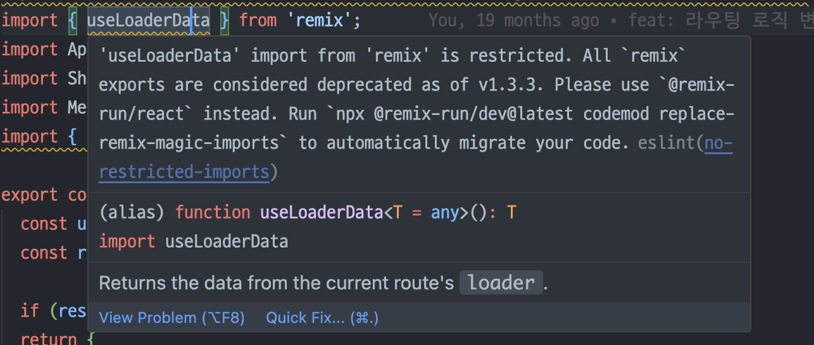
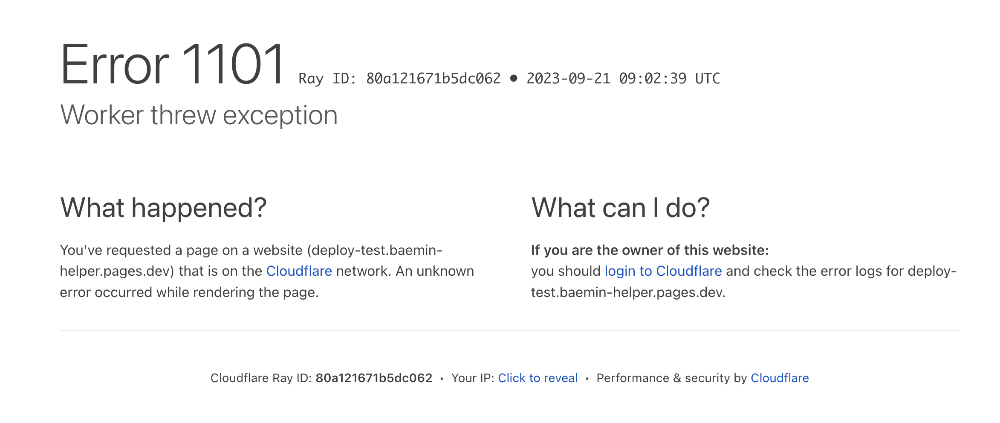
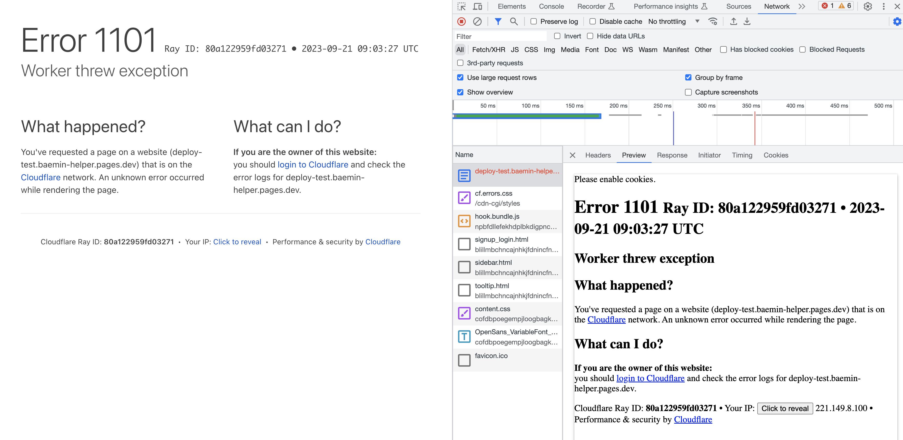
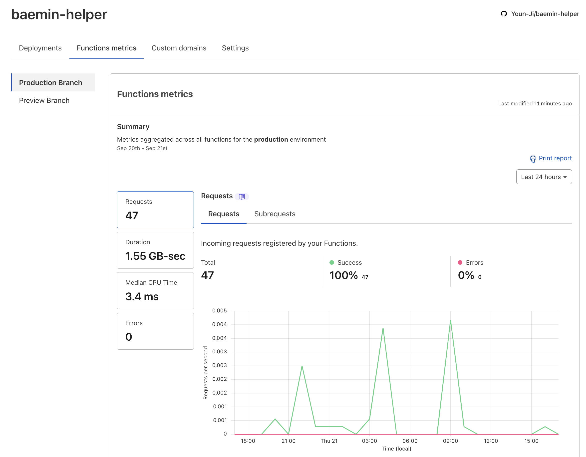
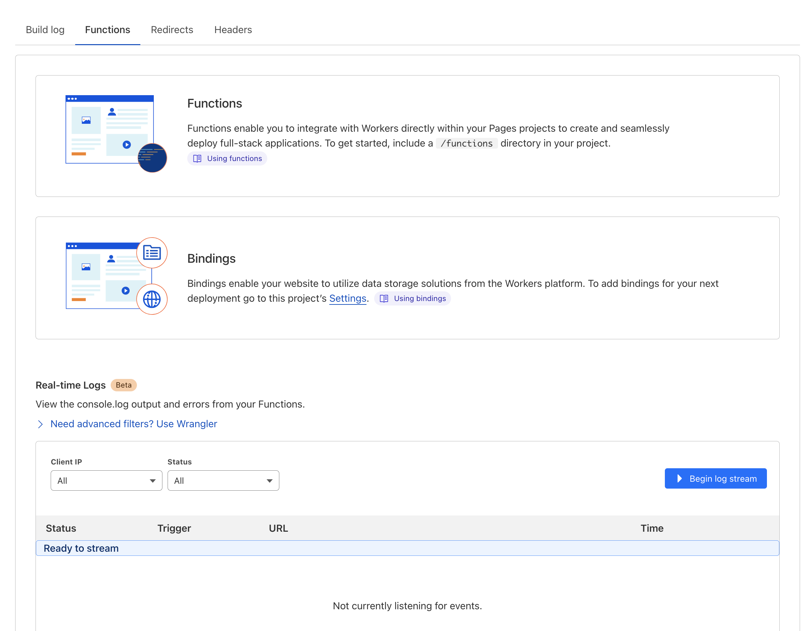
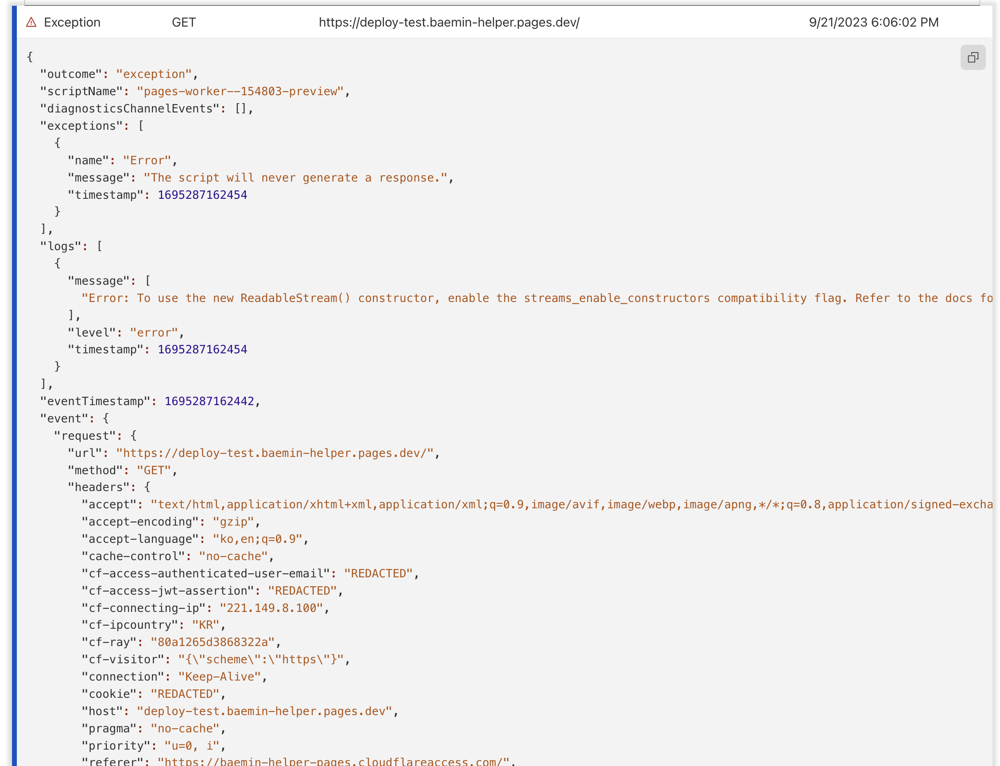

# 나의 작고 소중한 사이드 프로젝트 
 회사 출근했을 당시 점심을 배달로 시켜먹곤 했습니다. 여러명이 같이 주문을 하기 위해 배달의 민족 가게 링크를 슬랙으로 공유했습니다. 회사이다 보니 다들 PC로 먼저 확인했고 짧은 탄식과 함께 핸드폰을 주섬주섬 꺼내 앱으로 타고 타고 들어가 메뉴를 확인했습니다. (지금은 '함께 주문하기' 기능이 나와서 탄식은 잘 안들리는 것 같습니다.)
어느 날 동료 앱 개발자 분이 배민 웹을 만들고 싶은데 도와줄 사람을 찾고 있었습니다. 재빨리 손을 들었습니다. 
이후 빠르게 만들어 동료분들과 소소하게 사용했습니다. 괜히 배민께 피해갈라 앱으로 가는 딥링크도 연결해놨습니다. 
당시 사내 라이브러리인 디자인 시스템을 사용했는데, 퇴사 이후 배포하려고 보니, 토큰이 만료돼서 베포가 불가했습니다. 그렇게 해당 라이브러리를 걷어내지 않으면 배포할 수 없는 상황이 생겼고, 영원히 제 기억 속에서 잊혀......

져 가지 않고 다시 살려내보았습니다. 아래 내용은 그 삽질을 담은 내용입니다. 

이 프로젝트는 Remix를 사용했고 배포는 Cloudflare Pages를 사용했습니다. Remix CLI로 프로젝트를 세팅할 때, CloudFlare Pages 옵션이 있어서 선택했는데, Next.js에게 Vercel이 있다면 Remix에겐  Cloudflare인듯 합니다.

## 스타일링 라이브러리를 무엇으로 바꿔볼까
위에서 언급했듯이, 옛 직장의 사내 라이브러리를 들어내야 했습니다. (이것을 통해 의존성의 중요성을 다시 한번 깨달았습니다.)
일단 배포를 정상적으로 동작시키는 것이 우선이었고, 그를 위한 작업이라 시간을 많이 들이고 싶진 않았습니다. Radix와 같은 headless UI 라이브러리를 사용하고 그 위에 제가 원하는대로 스타일링을 덮을까 했지만 디자인하는데 시간이 오히려 걸릴 것 같았습니다. 배보다 배꼽이 큰 느낌. 
그러던 중 shadcn/ui 라는 라이브러리를 알게 됐습니다. Radix 와 Tailwind의 조합인데, 저는 Tailwind에 큰 거부감도 없고 오히려 쓰기 편했기 때문에 바로 적용하기로 결정할 수 있었습니다. 
그리고 Tailwind를 사용해 디자인 시스템 라이브러리를 어떻게 구현할 수 있는지 궁금했습니다.
아 그리고 전 회사의 디자인 시스템도 Radix UI 기반이었기 때문에 이해하기 쉬울 것이라고 판단했습니다.

아주 신기했던 것은 shadcn 이라는 배포된 npm 라이브러리가 있는게 아니었습니다. 유저 입장에서 설치해야하는 디펜던시는 radix와 tailwind 뿐이었습니다.
필요한 컴포넌트를 사용하고 싶을 때 shadcn 공홈에 있는 cli를 사용하면 radix 패키지가 설치되고 그에 맞는 컴포넌트 코드가 추가됩니다. 물론 shadcn 사용 전에 어느 곳으로 코드가 추가될지 config 파일을 작성해주어야 합니다. 라이브러리 코드가 궁금하면 굳이 타고 들어가지 않아도 되고 마치 제 코드처럼 수정할 수 있어 공부하기 아주 좋았습니다. 

### Remix 옛 버전에 Tailwind를 어떻게 설치할 것인가
작업 당시 가장 최근에 나온 Remix는 v1.19이고 v2.0로 올릴 준비가 만만인 상태였습니다. 제 플젝은 v1.1을 사용하고 있었습니다. 일단 v1.1에서 공식문서대로 테일윈드 설치를 해보려고 했으나, 실패했습니다. 문서를 잘 살펴보니 현재 나와있는 테일윈드 설치법은 Remix 프로젝트를 새로 만드는 것 뿐이고, 기존 프로젝트에 붙이는 방법은 없었습니다. 

그간 변화도 있었습니다. `remix` 패키지는 더이상 사용하지 않고, `remix-run/react` 여기서 기존 api를 import해서 쓴다던가, 기존 package.json에 있는 postinstall을 실행하려고 하니 거기에 있는 cloundflare page setup 명령어가 deprecated 되어 있었습니다.


<div style="display: flex; justify-content: center; font-size: 14px; color: gray"><span>작업 중 만난 에러 로그</span></div>
<br/>

v1.1.1에 테일윈드를 적용해놓은 [코드펜](https://codesandbox.io/s/2x8pg?file=/.gitignore)을 찾긴 했는데, 테일윈드 css를 빌드하고 output 디렉토리까지 지정해줘야 하는것으로 보였습니다. 근데 이 코드는 개발 서버용이기 때문에 production 배포까지 고려한 tailwind 설정이 필요했습니다. 여기서 버전을 최신으로 올리는 것이 낫겠다고 판단했습니다. 지금 한계에 부딪혀서 굴복한다고 다른 한계를 만나지 않는 것은 아니기 때문에. 조만간 v2도 나온다고 하니 미리 써보기도 할 겸 겸사겸사 진행했습니다. 

그래서 최근 CloudFlare Page로 배포되는 Remix 프로젝트는 어떻게 구성되는지 create remix로 만들어 확인해봤습니다. 변경된 부분(package.json 먼저, 그 다음에 진입점 파일들)을 비교해가며 일일이 수정해준 후에 인스톨하니 잘 구동되었습니다. 이후 Tailwind 설치도 공식문서대로 따라하니 잘 적용되었습니다. (개운)

버전을 올리며 인상 깊었던 것은, Remix에서 v2로의 스무스한 랜딩을 위해 future flag라는 기능을 제공한다는 것이었습니다. v2의 breaking changes를 remix.config 파일에서 on/off 해서 v1 에서도 쓸 수 있게 했습니다. 개발자 사용 편의를 많이 봐주고 있다는 것을 느낄 수 있었습니다. 
 
결국 Remix 버전 업데이트로 Tailwind를 잘 적용할 수 있었고 스타일링 라이브러리도 교체할 수 있었습니다. 
문제는 이 다음이었습니다. 

## CloudFlare Pages 배포 웨않대
배포할 때 remix build 단계에서 에러가 발생했습니다. 에러 로그를 보니 [이런 이슈](https://github.com/remix-run/remix/issues/2400)였고 Node 버전이 낮아서라는걸 알게되었습니다. 
CloudFlare Pages 대시보드에서 노드 버전을 어떻게 명시해줄 수 있나 찾아보니 환경 변수로 넣어주면 되는 것이었습니다. ([참고글](https://community.cloudflare.com/t/pages-node-js-version/295548)) 바로 적용해주고 다시 배포를 돌려보니 배포는 성공했습니다. 
그러나 페이지 접근 시에 아래와 같은 화면이 보였습니다. 


<div style="display: flex; justify-content: center; font-size: 14px; color: gray"><span>1101 에러</span></div>
<br/>

'cloudflare pages 1101 error'와 같은 키워드로 구글링을 해봐도 마땅한 글이 없어 헤매던 중, log를 확인해보라는 이야기가 있었습니다. 머리를 탁치며 노선을 바꿨습니다. 
처음엔 네트워크 탭을 살펴봤습니다. 


<div style="display: flex; justify-content: center; font-size: 14px; color: gray"><span>1101 에러의 네트워크 탭</span></div>
<br/>

딱히 도움 되는 것은 없었습니다. 새롭게 보이는 키워드로 구글링을 해보았으나 비슷한 내용만 나왔습니다.
그러던 중 CloudFlare Pages 대시보드를 살펴보면서 Functions Metrics 라는 로깅 시스템을 발견했고, 여기서 error를 count하고 있으니 관련 로그를 확인할 수 있는 방법도 있지 않을까 생각했습니다. 서버를 서빙하는 것도 이곳이니 분명 방법이 있을 것이라고 생각했습니다. 그렇게 계속 대시보드를 뒤졌습니다.


<div style="display: flex; justify-content: center; font-size: 14px; color: gray"><span>대시보드의 Function metrics 탭에서 Request와 Error에 대해서 간략하게 확인할 수 있다</span></div>
<br/>

그러던 중, 배포 시 빌드 로그가 쌓이는 디테일 섹션으로 들어가 Function 탭을 보니 RealTime Log 라는 베타 기능이 있는 것을 발견했습니다.


<div style="display: flex; justify-content: center; font-size: 14px; color: gray"><span>CloundFlare Pages에서 제공하는 베타 기능 RealTime Log</span></div>
<br/>

할렐루야. 로그를 찾았습니다. 


<div style="display: flex; justify-content: center; font-size: 14px; color: gray"><span>에러 1101의 진짜 원인</span></div>
<br/>

드디어 1101 에러의 원인을 찾을 수 있었습니다. 

To use the new ReadableStrea() constructor, …. compatibility flag를 가능하게 만들라는 것이었습니다. 

로그에 걸려있는 [링크](https://developers.cloudflare.com/workers/configuration/compatibility-dates/#compatibility-flags)를 들어가보니 `wrangler.toml` 에 설정해주는 것이었습니다. 이전 기능들과 호환성을 위해 제공되는 기능이었습니다. 처음엔 toml 파일을 직접 만들어 추가해주었는데, 1101 에러는 여전히 발생했습니다.

문서를 다시 읽어보니 `wrangler.toml`는 `npx wrangler deply` 라는 명령어로 배포를 해야 적용되는 것이었습니다. 배포 시 로그를 보면 `remix build`만 실행시키고 있었고 wrangler를 배포하는 듯한 작업은 보이지 않았습니다. 이 작업은 CloundFlare 내부적으로 어딘가에서 수행하는 것으로 생각했습니다. 그렇다면 이 부분을 관리하는 대시보드 기능이 분명 있을 것이라 생각하고 다시 한번 더 찾아보았습니다. 

> Compatibility dates can only be set via your `wrangler.toml` file and by running `[npx wrangler deploy](https://developers.cloudflare.com/workers/wrangler/commands/#deploy)`.

역시나 찾을 수 있었습니다. 설정의 환경변수 탭 바로 아래에 Functions 라는 것이 있었고 Compatibility Date 와 Flag를 관리하는 섹션이 있었습니다.
Compatibility Date가 이 사이드 프로젝트를 진행했을 즈음의 날짜로 설정되어 있는 것을 확인할 수 있었습니다. 바로 최근 날짜로 수정하고 재배포하니 정상적으로 접근할 수 있는 것을 확인했습니다.

이상 대시보드와 열심히 싸워 결국 이긴 기록이었습니다. 

감사합니다.

```toc
```


