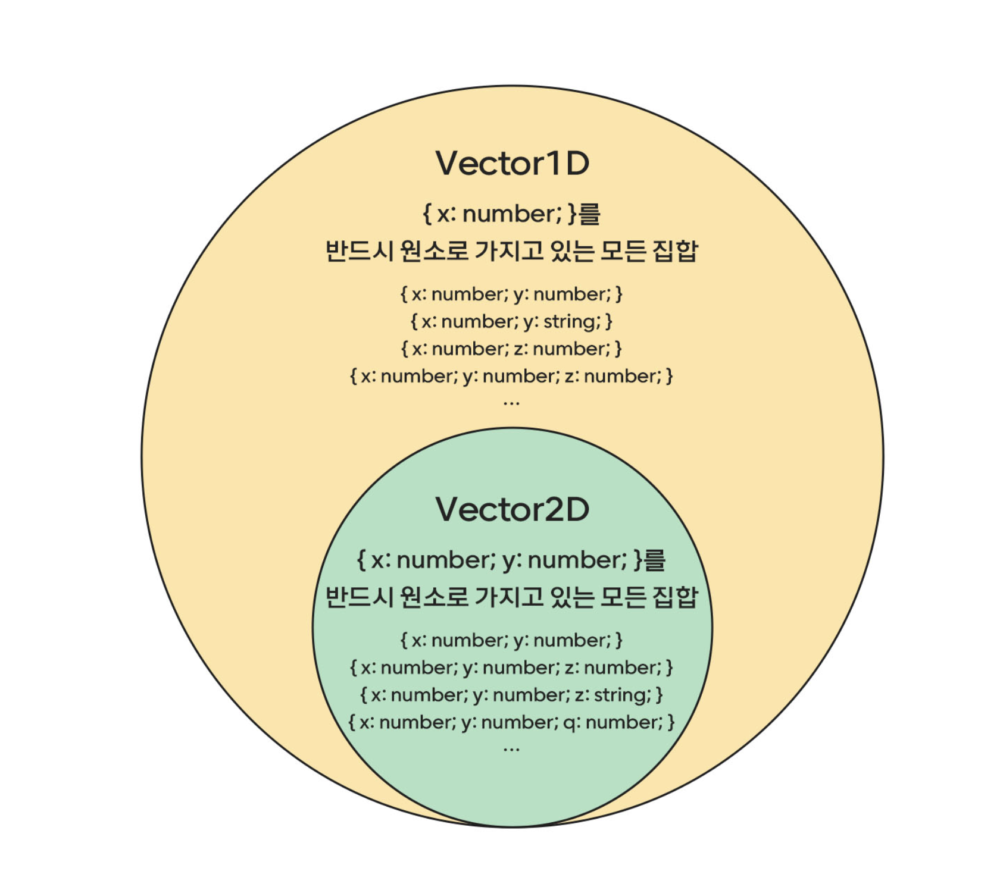

## 집합이 뭐드라 
SNS를 보던 와중에 이런 글을 보게 되었다. https://www.winterlood.com/qna/3ea6c36c-c425-434c-9dd3-5dfd6dfdc4be
오 나도 잘 모르던건데 잘 됐다 하고 답변을 읽어보는데,, 읭,, 이해가 하나도 되지 않았다. 
'Intersection이 교집합이라는데… 왜 합집합처럼 작동하지?' 아래는 이를 이해하기 위한 여정을 담은 기록입니다. 

A와 B의 교집합이라는 말뜻만 보면 A와 B를 모두 만족시키는 집합이다. 

```ts
type Dog = {
  name: string;
  color: string;
};

type Person = {
  name: string;
  language: string;
};
```
와 같은 타입이 있다고 했을 때, Dog & Person 타입은 아래처럼 됩니다.

```ts
type Intersection = {
 name: string;
 color: string;
 language: string;
}
```

타입 Inersection 은 Dog도 될 수 있고 Person도 될 수 있는데요. 이런한 이유는 타입스크립트가 구조적 타이핑을 따르기 때문입니다. 타입 스크립트에서 타입 호환성을 결정하는 주요 메커니즘입니다. 명목적 타이핑과 대조적이라고 보는데 아래에 예시가 있습니다. 

```ts
interface Dog {
    name: string;
}

interface Cat {
    name: string;
}

let dog: Dog = { name: "Rover" };
let cat: Cat = { name: "Whiskers" };

dog = cat; // 아무 문제 없음!
```

```ts
class Dog {
    String name;
    Dog(String name) {
        this.name = name;
    }
}

class Cat {
    String name;
    Cat(String name) {
        this.name = name;
    }
}

public class Test {
    public static void main(String[] args) {
        Dog dog = new Dog("Rover");
        Cat cat = new Cat("Whiskers");

        dog = cat; // 컴파일 에러: Cat을 Dog에 할당할 수 없습니다.
    }
}
```

위 예시와 같이 구조적 타이핑은 내부 구조가 동일하거나 호환될 경우 명시적인 관계나 상속 없이도 호환성이 있다고 간주됩니다. 

그래서 Intersection과 같은 타입이 Person도 될 수 있고 Dog도 될 수 있는 것입니다. 

학창 시절 배운 집합에서 교집합은 당연히 원본 타입보다 갖고 있는 key의 갯수가 적어야할 것 같지만, 타입스크립트에선 오히려 더 많은 key를 가진 새로운 타입을 생성합니다.
그리고 이건 요 글을 보니 좀 더 이해하기 쉽웠습니다. 

> more like a condition / constraint.

> Then, {} type is not an "empty object" type corresponding to a {} JS literal, but a "thing where I can access properties, but I don't care about any particular properties". Aha, now we can see what's going on in our initial mind-bender: if x = 9, you can safely x['whatever'], so it satisfies the unconstrained {} interface.

{} 내부에서 정의되는 타입을 들어올 수 있는 값에 조건을 걸거나 제한하는 것으로 봐보자는 것입니다. 제약 사항이 많아질수록 그 안에 모일 수 있는 값의 수는 줄어듭니다. 

스무고개할 때, 질문을 하나 하나 더해갈수록 답의 후보군이 줄어드는 것과 비슷한 원리라고 생각됩니다. 

 때문에 제한하는 값이 많을 수록 = key가 많아질수록 더 적은 부분을 커버하게 됩니다. 즉 아래처럼 그림으로 그려봤을 때 key의 갯수는 더 많아졌지만, 더 적은 부분을 담당하게 된다는 것이죠.


<div style="display: flex; justify-content: center; font-size: 14px; color: gray"><span>출처: 화해 기술 블로그 (https://blog.hwahae.co.kr/all/tech/9954)</span></div>
<br/>

위에서 설명한 것은 {}와 같은 객체 타입에 관한 것이고 원시타입은 원시타입대로 생각해야 합니다. 

string & number 와 같이 원시타입에서 교집합을 찾으려고 하면 never가 나오겠죵. string이면서 number가 될 순 없으니깐요.
교집합은 제약조건을 합치는 것이라고 생각하자. 제약 조건이 많아질수록 범위는 더 좁아진다. 

Union 타입은 합집합은 A와 B의 조합을 가진 여러개의 타입이 허용됩니다. 이것 또한 구조적 타이핑 덕분이죵. A 또는 B를 만족하는 모든 타입을 허용해주는 것이니까요.

이로써 Intersection과 Union이 어떻게 동작하는지 확실하게 알 수 있었습니다. 


```toc
```


