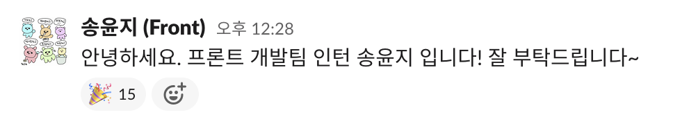

## 2021년에 한 것
코딩 부트캠프를 2월에 수료하고 한 달간 취업 준비를 했다. 
### 4월, 현재 회사의 인턴으로 입사



- 뭐가 뭔지 모른채 개발환경을 세팅했고, 주어지는 일을 쳐나갔다. 처음 받은 업무는 홈페이지 약관 링크 변경이었는데, 배웠던 것을 써먹을 생각에 설레고 흥분되었던 것이 생각난다. 
- remote와 local 브랜치 싱크 맞추라는 말도 이해 못했던 그때.. 이제는 cli 도 어느정도 알고, git이 꼬일까봐 겁내지도 않는다.
- 이때는 모든 회의의 내용들을 기록했다. 전사회의, 프론트팀 스탠덥, 심지어 회고까지.. 무엇이 내게 필요한 정보인지 알지 못했기 때문에 하나라도 놓치지 않기 위해 노력했었다. 지금은 필요한 내용만 기록하고 있다. 

### 5월, 홈페이지 본인 인증 기능 추가
- 작은 feature를 맡아 작업을 하게 되었다. 회사에서 이미 사용하고 있는 Multi PG사의 본인 인증 api를 사용하면 되는 것이었다. 
- 지금 생각하면 정말 간단한데, 그 때는 참 어렵게 진행했다. 코드리뷰를 봐주시던 팀원 분께서 구조적으로 더 나은 방향을 제안해주셨고, 그에 맞게끔 수정해나가는 과정이 쉽지 않았다. 첫 코드리뷰 였기에 잘하고 싶은 마음이 앞서서 긴장도가 높았던 것 같다. 
- 이때 가장 어려웠던 것이 일정 산정이었다. 얼만큼 걸릴지 도무지 알 수 없었다. (솔직히 지금도 잘 모른다.) 일정을 산출하고 due date를 스스로 말하는 것만큼 부담스러운 일은 없는 것 같다. 그것 덕분에 작업물에 대한 책임감과 오너십을 가질 수 있다고 생각하지만 여전히 어렵다.

### 6월, 프로모션 페이지 개발과 포스트모템
- 현재는 운영팀에서 간단한 프로모션 페이지는 만들 수 있게끔 시스템이 구축되어있는데, 당시에는 프로모션이 있을 때마다 프론트 개발자의 리소스가 필요했다. 
- 프로모션 페이지의 주요 기능 중 하나는 쿠폰 발급이었다. 유저가 쿠폰을 눌렀을 때 해당하는 쿠폰을 발급받을 수 있도록 해야했고, 이미 발급받은 내용에 대해서는 disable 처리를 해줘야했다. 이때 처음으로 react-query 라는 서버 상태 관리 라이브러리를 사용해보았다. 
- 이때 기억에 남는 것은 개발보다는 사건, 사고이다. 일단 프로모션 기간과 택배 파업이 겹쳐 유저들의 불만이 접수된 상황이었다. 이로 인해 프로모션 기간을 늘렸고 페이지에 관련 내용 업데이트가 필요했다. 처음으로 퇴근 시간이 훌쩍 넘은 시간까지 상황을 모니터링했고 그에 맞춰 핫픽스 배포를 했다. 
- 프로모션 페이지 개발과 함께 배포된 작은 변경점이 있었다. 프론트에서 보내던 데이터 분석 이벤트를 서버에서 보낼 수 있도록 한 것이었는데, 여기서 웹과 앱이 통신하는 회사 내부 모듈을 사용했다. 이때 사용했던 모듈의 함수로 인해, 앱의 특정 버전 유저들이 결제를 못하는 이슈가 발생했다. fallback 처리를 잘 해주었더라면 일어나지 않았을테지만, 그때는 알지 못했다. 원인 규명에 하루가 넘게 소요됐고 회사는 그에 따른 손실을 보았다. 이것으로 포스트모템을 했다. 
- 처음으로 해본 포스트모템은 긴장되고 불안했다. 죄짓고 교무실 불려가는 느낌이랄까.. 하지만 막상 참가해보니 분위기에서 압박감이 느껴진다거나 자기 반성의 시간은 전혀 아니었고 정확한 원인규명과 앞으로 어떻게 하면 좋을지에 대한 이야기가 주였다. 서로 잘못을 돌리지 않고 오히려 자신이 좀 더 챙기지 못한 것을 아쉬워 하는 모습에 감동받기도 했다. 좋은 사람들과 함께 하고 있구나를 느낄 수 있는 값진 경험이었다. 


### 7~8월, 새벽 배송
- 처음으로 작업해야하는 양의 피그마가 한 페이지를 넘어섰고, 피그마의 다양한 기능을 알지 못하면 개발에 어려움을 겪을 수 있는 프로젝트를 맡게 되었다. 
- 같은 도메인을 봐주시던 팀원 분께서 퇴사를 했던 터라, 운 좋게(=나쁘게?) 자연스레 맡아서 진행하게 되었다.
- 처음엔 작업 범위가 작았다. 기존 디자인은 유지하고 텍스트를 추가하는 정도였기에 당연히 할 수 있었다. 하지만 일이 점점 커져갔고 아 해야하는가보다. 하면 되는가보다 했다. 
- 훌륭한 디자이너, QA, 프론트/서버 개발자님과 함께 한 덕에 할 수 있었다. 멘탈이 빠져나가려고 할 때 멘탈 체크 해주시고, 일정이 빠듯해보일때 두발 벗고 업무를 줄여주셨다. 
- 이 모든 것을 가능하게 한 것은 정말 100% 동료 덕분이었다. 
- Redux saga, Redux perist 등을 접해보았다. 작업을 진행했던 코드 베이스가 꽤 오래되었기 때문에 레거시는 이런 것이구나도 알게 되었다. (클래스형 컴포넌트라던가..)
- 아직 기억에 남는 것 중에 팀장님과의 코드리뷰가 있다. PR의 변경된 라인수를 신경쓸 수 있는 짬밥이 되지 않았을 때였다. 변경점은 너무 많은 것 같고 팀장님께 리뷰는 받아야겠고 하니, 나름대로 PR에 코멘트를 열심히 달며 설명하려고 애썼던 모습이 기억에 남는다. 
- 그리고 정규직 전환 💡


### 9월, 온보딩 페이지
- 회사에서 새롭게 출시된 온라인 홈트 프로젝트의 온보딩 페이지를 맡게 되었다. 앞의 프로젝트들과는 성격이 좀 다른 애니메이션이 꽤 들어간 디자인이었다.
- 거의 아무것도 없는 코드베이스로 시작을 했다. 단순 페이지 개발 뿐만 아니라 데이터/마케팅 스크립트 초기 세팅도 챙겨야 하는 부분이 있어 쉽지 않았다. 
- [framer](https://www.framer.com/docs/)라는 애니메이션 라이브러리를 사용했다. 언제나 새로운 것은 재밌으면서 어렵다. 이래서 나이들수록 보수적으로 변하는 것일까 😂 
- 디자이너님과 소통을 많이 할 수 있는 프로젝트였다. 특히나 애니메이션이 많다 보니 마이크로한 부분까지 소통할 수 있어야 했다. 최대한 디자인대로 나올 수 있게 하기 위해 노력했지만 역량의 부족함을 느낄 수 있는 프로젝트 중 하나였다. 
- 애니메이션에 익숙하지 않다보니 due date도 정확하게 산정할 수 없었다. 시간이 좀 더 필요하다(=due를 늘려달라)는 커뮤니케이션을 이때 가장 많이 한 것 같다.

### 10~12월, 코칭툴
- 위의 온라인 홈트 프로젝트에서 코치님과 함께 할 수 있는 확장판이 생겼고, 코치님들이 코칭에 사용할 툴을 만들게 되었다.
- 라이브러리부터 폴더구조, 컴포넌트 작성법까지 모두 새로웠다. 위에서 말했다시피 또다시 새로운 것에 적응하는 것이 쉽지 않았지만, 결국은 다 하게 됨을 깨달았다. 계속 새로운 것을 배우고 적용해 나가야하는 운명이니 피할 수 없다면 즐겨야겠다.
- 스토리북, 테스트 코드 등을 쓸 수 있었고 그에 대한 리뷰를 받을 수 있는 것이 좋았다. 
- 가장 기억에 남는 것은 코칭툴의 채팅 기능을 구현한 것이다. [socket io](https://socket.io/docs/v4/)를 사용해 실시간 채팅을 구현했고, 이를 위해 앱 개발자, 서버 개발자 분들과도 이야기를 나눠볼 수 있었다. 편하게 질문하고 조언을 구할 수 있는 환경에 감사했다.
- 채팅 기능 중에 가장 애먹었던 것 중에 하나가 스크롤이었다. 위로 스크롤하면 이전 채팅 목록을 가져오고 그때마다 스크롤은 새로운 데이터를 따라 올라가는 것이 아닌 유저가 보고 있는 화면에 유지되어야 했다. 이를 구현하기 위해 [ResizeObserver](https://developer.mozilla.org/en-US/docs/Web/API/ResizeObserver)라는 웹 api를 사용했다. 어떻게 구현했는지는 포스팅을 따로 해보도록 하겠다.
- 위의 모든 과정을 혼자가 아닌 팀원과 페어로 진행했다. 이때까지 모든 프로젝트를 혼자 진행하다가 처음으로 협업을 통해 과제를 해결한 경험이었다. 기쁨은 나눌수록 배가 된다고 했던가.. 문제를 해결했을 때의 그 기분은 아직도 생생하다. 
- 이 프로젝트를 통해 좋은 동료를 얻었고, 그 동료에게서 배울 점이 아직도 많다는 것에 매우 감사하다.

## 총평
- 돌이켜보면 많은 프로젝트를 했고, 많은 글을 읽었고, 많은 개념을 접했다. 하지만 이 모든 것들이 완전히 내것이 된 것은 아니다. 어떻게 하면 일을 통해 접한 것들을 완전히 내것으로 만들 수 있을지 고민하고 노력하려고 한다.
- 좋은 동료들과 함께 함에 감사하다. 모두가 성장을 원하고 있고, 서로에게 좋은 자극점이 되어주고 있다. 함께 성장할 수 있는 2022년이 더욱 기대가 된다.
- 회고를 제대로 써보는 것은 처음인 것 같다. 2022년 회고를 적을 때, 내가 이만큼 성장했구나 돌아볼 수 있는 비교군이 되기를 바란다.


## 2022 목표
- 블로그 작성하기
- 사이드 프로젝트 
- 알고리즘 문제 풀기
- 기술 블로그/문서 읽고 정리하기 
- 기초 채우기 (CS 지식 또는 웹개발에 대한 깊은 이해를 목적으로 공부하기)


```toc
```
